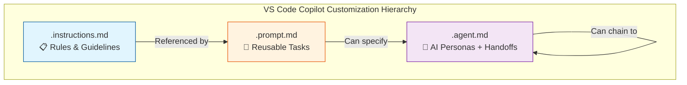
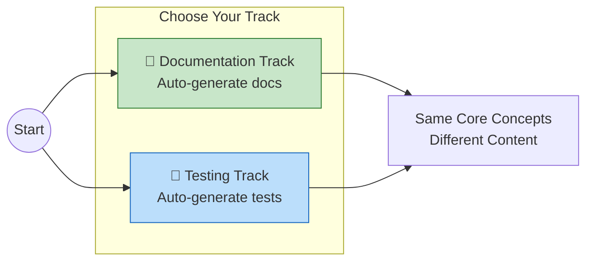
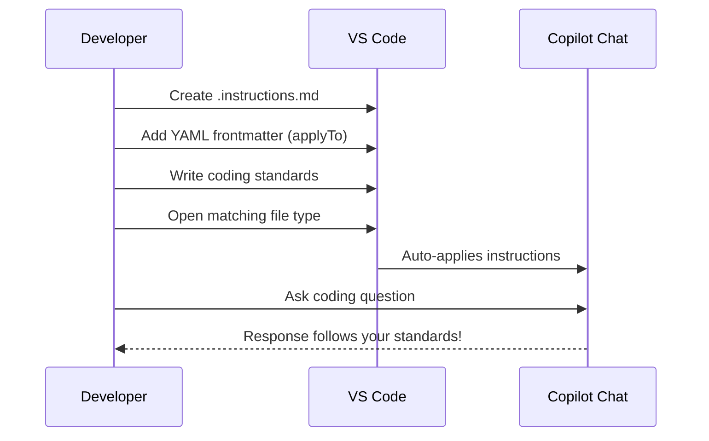
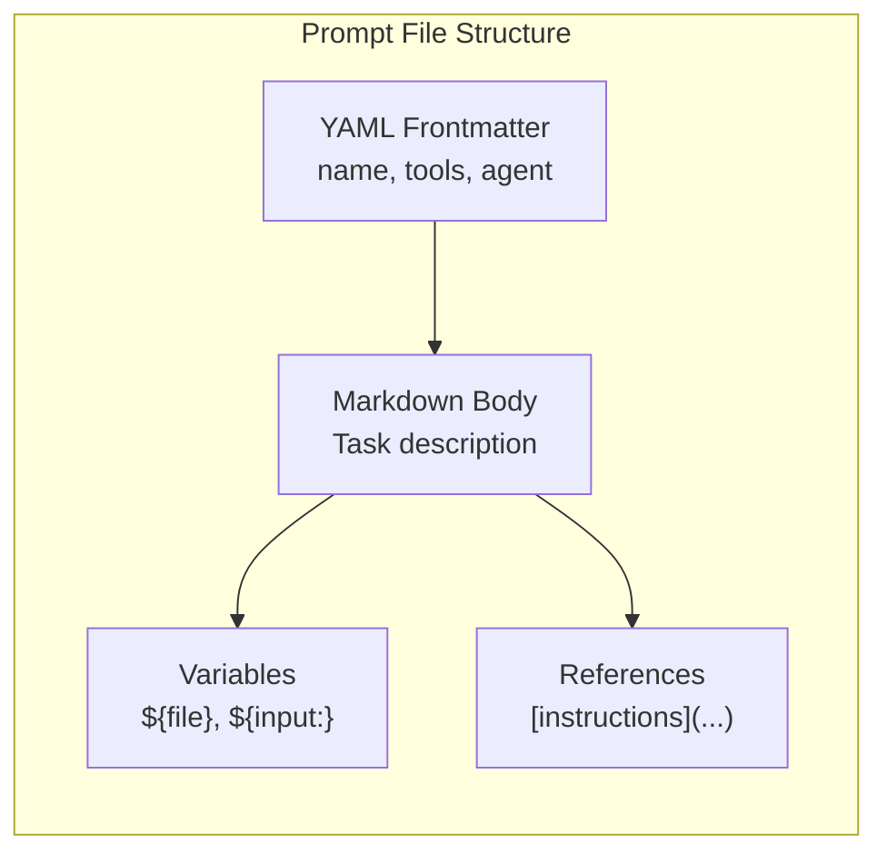
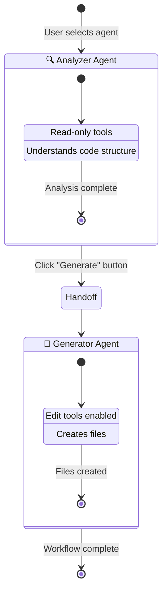
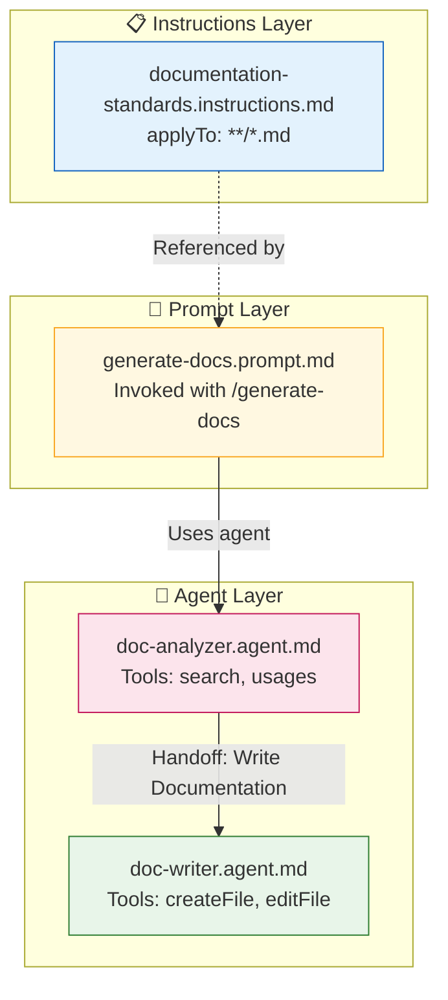
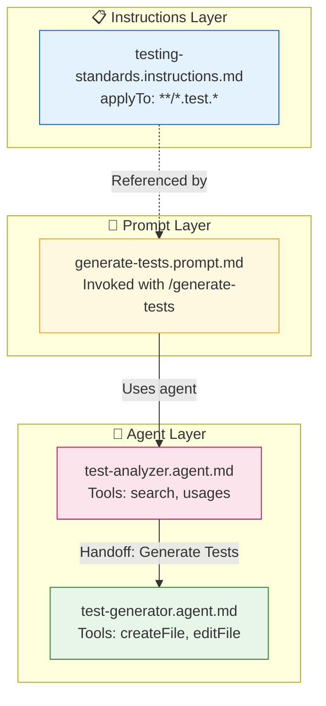

# 🎯 Hands-On Lab Structure: From Vibe Coding to Vibe Engineering

## Executive Summary

This hands-on lab guides participants from simple instruction files to fully orchestrated agent workflows using VS Code Copilot's native customization primitives. The lab follows a **dual-track approach** where participants choose between documentation generation or test generation workflows.

---

## 🏗️ Lab Timeline (60 minutes)

```mermaid
gantt
    title Lab Timeline
    dateFormat X
    axisFormat %M min
    
    section Setup
    Phase 0 - Setup & Context     :0, 5
    
    section Foundation
    Phase 1 - Custom Instructions :5, 15
    
    section Automation
    Phase 2 - Prompt Files        :20, 15
    
    section Orchestration
    Phase 3 - Agents & Handoffs   :35, 20
    
    section Wrap-up
    Phase 4 - Exploration & Q&A   :55, 5
```



---

## 📚 The Three Primitives



| Primitive | Purpose | Trigger | Complexity |
|-----------|---------|---------|------------|
| `.instructions.md` | Define rules/guidelines | Auto-applied or manual | ⭐ Simple |
| `.prompt.md` | Reusable task workflows | `/command` in chat | ⭐⭐ Moderate |
| `.agent.md` | AI personas with handoffs | Agent dropdown | ⭐⭐⭐ Advanced |

---

## 🎓 Two Tracks

Participants choose one track based on their interest:



| Track | Focus | Deliverable |
|-------|-------|-------------|
| **📖 Documentation** | Auto-generate documentation | Instructions → Doc Prompt → Analyzer + Writer Agents |
| **🧪 Testing** | Auto-generate unit tests | Instructions → Test Prompt → Analyzer + Tester Agents |

---

## 📖 Phase Details

### Phase 0: Setup & Context (5 min)

**Objectives:**
- Verify VS Code settings are enabled
- Orient participants to the three primitives
- Choose a track (documentation or testing)

**Checklist:**
- [ ] VS Code with GitHub Copilot extension
- [ ] Settings enabled: `chat.promptFiles`, `github.copilot.chat.codeGeneration.useInstructionFiles`
- [ ] Lab repository cloned or project folder ready

---

### Phase 1: Foundation - Custom Instructions (15 min)

**Objectives:**
- Create a `.instructions.md` file with frontmatter
- Define team/project standards
- Test auto-application in Copilot Chat



**Deliverable:** A working instruction file that automatically applies when editing matching files.

---

### Phase 2: Task Automation - Prompt Files (15 min)

**Objectives:**
- Create a `.prompt.md` file
- Reference the instruction file
- Use variables and specify tools
- Invoke via `/command`



**Deliverable:** A reusable prompt invocable via `/command` in Copilot Chat.

---

### Phase 3: Orchestration - Agents with Handoffs (20 min)

**Objectives:**
- Create two `.agent.md` files
- Define specialized AI personas
- Implement handoff between agents
- Test the sequential workflow



**Deliverable:** Two agents with a working handoff button.

---

### Phase 4: Wrap-Up (5 min)

**Objectives:**
- Share patterns discovered
- Q&A and advanced scenarios
- Resources for continued learning

---

## 🔄 Workflow Diagrams by Track

### 📖 Documentation Track



### 🧪 Testing Track



---

## 📁 Repository Structure

```
vibe-engineer-lab/
├── README.md                          # Step-by-step lab guide
├── lab-structure.md                   # This file
├── cheatsheet.md                      # Quick reference
├── .vscode/
│   └── settings.json                  # Pre-configured settings
│
├── golden-examples/                   # Reference implementations
│   ├── documentation-track/
│   │   ├── .github/
│   │   │   ├── instructions/
│   │   │   │   └── documentation-standards.instructions.md
│   │   │   ├── prompts/
│   │   │   │   └── generate-docs.prompt.md
│   │   │   └── agents/
│   │   │       ├── doc-analyzer.agent.md
│   │   │       └── doc-writer.agent.md
│   │   └── sample-code/
│   │
│   └── testing-track/
│       ├── .github/
│       │   ├── instructions/
│       │   │   └── testing-standards.instructions.md
│       │   ├── prompts/
│       │   │   └── generate-tests.prompt.md
│       │   └── agents/
│       │       ├── test-analyzer.agent.md
│       │       └── test-generator.agent.md
│       └── sample-code/
│
└── starter-templates/                 # Scaffolds for participants
    ├── instructions-template.instructions.md
    ├── prompt-template.prompt.md
    └── agent-template.agent.md
```

---

## ✅ Success Criteria

By the end of the lab, each participant should have:

| Deliverable | Validation |
|-------------|------------|
| ✅ 1 Custom Instruction file | Applied automatically when editing matching files |
| ✅ 1 Prompt file | Invocable via `/command` in Copilot Chat |
| ✅ 2 Agent files with handoff | Visible handoff button after first agent completes |
| ✅ Working workflow | Successfully generates docs OR tests for their code |

---

## 🎯 Key Pedagogical Decisions

1. **Native VS Code Format Over APM** - Keep it simple with `.instructions.md`, `.prompt.md`, `.agent.md`
2. **"Bring Your Own Project" with Fallback** - Participants use their code; golden examples provide backup
3. **Progressive Disclosure** - Instructions → Prompts → Agents (simple to complex)
4. **Analyzer → Generator Pattern** - Read-only analysis, then handoff to editing agent

---

## 📖 Related Documentation

- [VS Code Copilot Customization Overview](https://code.visualstudio.com/docs/copilot/customization/overview)
- [Custom Instructions](https://code.visualstudio.com/docs/copilot/customization/custom-instructions)
- [Prompt Files](https://code.visualstudio.com/docs/copilot/customization/prompt-files)
- [Custom Agents](https://code.visualstudio.com/docs/copilot/customization/custom-agents)
